# strat-creator

Strategy refinement pipeline for RHAI (Red Hat AI) features. Takes approved RFEs from the RFE assessment pipeline and produces structured strategy documents ready for development planning.

## Pipeline Overview

```mermaid
graph LR
    subgraph "Phase 1: RFE Assessment"
        A[rfe.create] --> B[rfe.review]
        B --> C[rfe.auto-fix]
        C --> D[rfe.submit]
    end

    subgraph "Phase 2: Strategy Refinement"
        E[strategy.create] --> F[strategy.refine]
        F --> G[strategy.review]
        G -->|revise| H[strategy.revise]
        H -->|max 2 cycles| G
        G -->|submit| I[strategy.submit]
    end

    subgraph "Phase 3: Feature Dev"
        J[Feature Ready] --> K[Prioritize]
        K --> L[AI-Assisted Dev]
        L --> M[PR Review]
    end

    D -->|"approved RFEs\n(score ≥9)"| E
    I -->|"strategy ready"| J

    style A fill:#2d6a2d,color:#fff
    style B fill:#2d6a2d,color:#fff
    style C fill:#2d6a2d,color:#fff
    style D fill:#2d6a2d,color:#fff
    style E fill:#c77d1a,color:#fff
    style F fill:#c77d1a,color:#fff
    style G fill:#c77d1a,color:#fff
    style H fill:#555,color:#fff
    style I fill:#555,color:#fff
    style J fill:#555,color:#fff
    style K fill:#555,color:#fff
    style L fill:#555,color:#fff
    style M fill:#555,color:#fff
```



**Legend:** Green = implemented (rfe-creator) | Orange = implemented (strat-creator) | Gray = not started

Each pipeline step runs in its own Claude session with a fresh context window (per [Lesson 1: The Agent Forgets Mid-Run](../wiki/05-lessons-and-patterns.md#1-the-agent-forgets-mid-run)). Artifacts on disk are the handoff between steps. All external writes go through deterministic scripts with `--dry-run` support (per [Lesson 4](../wiki/05-lessons-and-patterns.md#4-every-side-effect-must-be-a-deterministic-script)).

### Running the Pipeline

```bash
# Session 1: Create strategy stubs from RFEs
/strategy.create config/test-rfes.yaml --dry-run

# Session 2: Refine — add technical approach, dependencies, components
/strategy.refine --dry-run

# Session 3: Review — 4 independent adversarial reviewers
/strategy.review --dry-run

# Generate HTML report (no LLM needed)
python3 scripts/generate-report.py
```

## Implementation Status

| Skill | Status | Description |
|-------|--------|-------------|
| `strategy.create` | Implemented | Creates strategy stubs from approved RFEs, saves original RFE snapshots |
| `strategy.refine` | Implemented | Adds technical approach using architecture context, size-scaled templates |
| `strategy.review` | Implemented | Orchestrates 4 independent forked reviewers |
| `strategy-feasibility-review` | Implemented | Technical viability and effort credibility |
| `strategy-testability-review` | Implemented | Measurable criteria and edge cases |
| `strategy-scope-review` | Implemented | Right-sizing and scope boundaries |
| `strategy-architecture-review` | Implemented | Platform fit and dependency correctness |
| `strategy.run` | Reference | Pipeline sequence documentation (not invocable — each step runs in its own session) |
| `generate-report.py` | Implemented | HTML report with summary table and drill-down details |
| `strategy.revise` | Not started | Revision cycle with guardrails (max 2 cycles) |
| `strategy.submit` | Not started | Deterministic Jira writes via script |
| `security-review` | Not started | Security dimension reviewer |
| `api-readiness-review` | Not started | API readiness dimension reviewer |

## Project Structure

```
strat-creator/
├── scripts/          # Reusable Python/shell scripts (Jira, frontmatter, state, report)
├── .claude/skills/   # Claude Code skills defining each pipeline step
├── config/           # Test RFE IDs and pipeline configuration
├── rubric/           # Quality rubric with scoring criteria (planned)
└── artifacts/        # Pipeline output (gitignored)
    ├── strat-tasks/      # Generated strategy documents
    ├── strat-reviews/    # Review outputs per dimension
    ├── strat-originals/  # Original RFE snapshots
    └── reports/          # Timestamped HTML reports
```

## Related Projects

- **rfe-creator** — Phase 1: RFE assessment pipeline (upstream). Has `strat.*` skill stubs that these skills were forked from.
- **strat-pipeline** (GitLab) — CI runner for this pipeline
